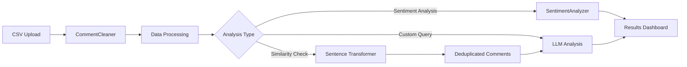

# FEEDBACKl

A Flask-based web application that analyzes user comments using sentiment analysis, similarity detection, and AI-powered insights.



## Features

- **CSV Upload**: Process comment data from CSV files
- **Sentiment Analysis**: Analyze comment sentiment using TextBlob
- **Similarity Detection**: Remove duplicate or highly similar comments using sentence transformers
- **AI-Powered Insights**: Generate detailed insights and suggestions using LLM integration
- **Interactive Query Interface**: Ask specific questions about your comment data

## Installation

1. Clone the repository:
```bash
git clone https://github.com/yourusername/comment-analysis-tool.git
cd comment-analysis-tool
```

2. Install dependencies:
```bash
pip install -r requirements.txt
```

3. Create a `.env` file with your configuration:
```bash
OPENAI_API_KEY=your_api_key_here
```

## Dependencies

- Flask
- python-dotenv
- TextBlob
- sentence-transformers
- scikit-learn
- pandas
- numpy
- markdown

## Usage

1. Start the Flask server:
```bash
python app.py
```

2. Navigate to `http://localhost:5000` in your web browser

3. Upload a CSV file containing a 'comment' column

4. Analyze your comments using the available features:
   - View sentiment distribution
   - Generate AI insights
   - Ask specific questions about your data

## API Endpoints

### POST /upload_csv
Upload a CSV file containing comments for analysis.

### POST /analyze
Analyze uploaded comments with customizable parameters:
- `max_comments`: Maximum number of comments to analyze (default: 1000)
- `similarity_threshold`: Threshold for detecting similar comments (default: 0.85)

### POST /send_message
Ask specific questions about your comment data.

## Project Structure

```
├── app.py                 # Main Flask application
├── templates/
│   └── index.html        # Frontend interface
├── requirements.txt       # Python dependencies
└── .env                  # Environment variables
```

## Key Components

### CommentCleaner
- Removes HTML tags and non-ASCII characters
- Ensures clean text input for analysis

### SentimentAnalyzer
- Calculates sentiment polarity using TextBlob
- Provides sentiment distribution statistics

### InsightGenerator
- Removes similar comments using cosine similarity
- Generates AI-powered insights using LLM integration

